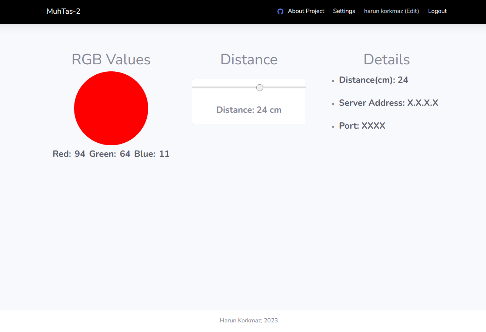
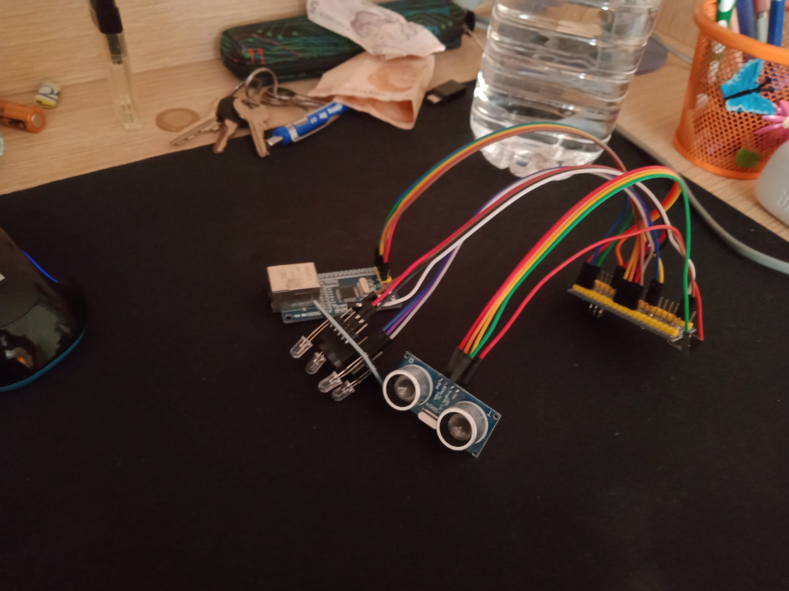
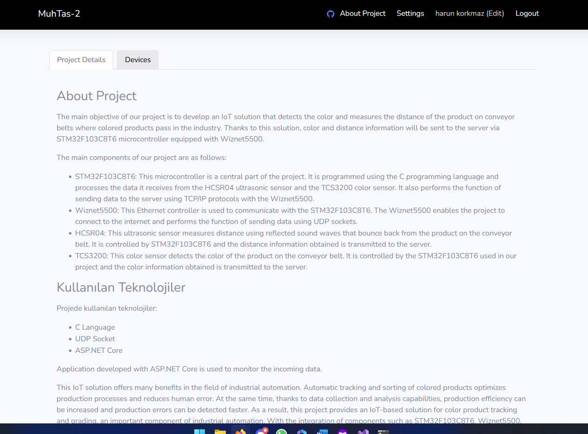
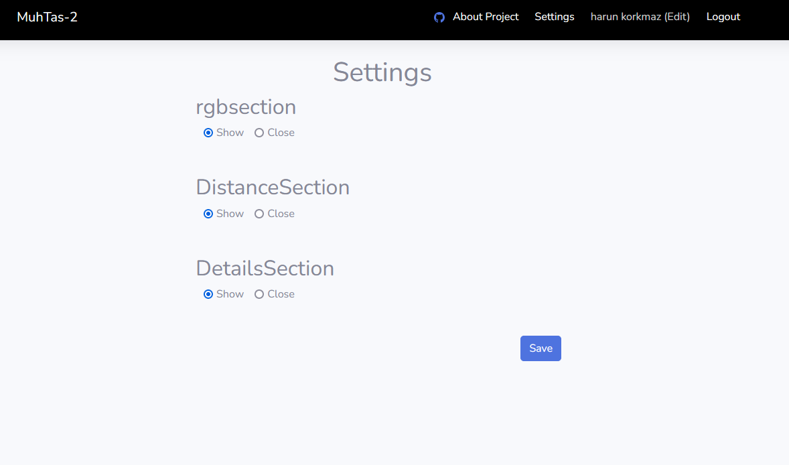

# Mühendislik Tasarımı 2 IoT Projesi

Bu proje, Mühendislik Tasarımı 2 dersi kapsamında gerçekleştirilen bir IoT (Internet of Things) projesidir. Proje, konveyör bandı üzerinde hareket eden paketlerin renk ve mesafe bilgilerini toplayabilen bir IoT cihazı ve bu verileri işlemek ve görüntülemek için bir web arayüzü oluşturmayı hedeflemektedir.

 

#### Canlı versiyon aktif => <a href="http://karunland.eastus.cloudapp.azure.com:5005/" target="_blank">karunland.eastus.cloudapp.azure.com:5005/</a> 
  

<!-- 
 -->

 

## Proje Komponentleri

1. **STM32F103T8C6 MCU:** Bu mikrodenetleyici birim, tüm sensörler arasındaki iletişimi ve veri toplama işlemlerini yönetir.

2. **TCS3200 Renk Sensörü:** Bu sensör, paketlerin renk bilgilerini toplar.

3. **HC-SR04 Uzaklık Sensörü:** Bu sensör, paketlerin konveyör bandı üzerindeki konumunu belirler.

4. **WIZnet 5500 Ethernet Modülü:** Bu modül, toplanan verileri UDP üzerinden web arayüzüne gönderir.

## Web Arayüzü

Web arayüzü ASP.NET Core 6.0 kullanılarak geliştirilmiştir. Veritabanı olarak MongoDB kullanılmış ve Entity Framework Core ile entegre edilmiştir. Arayüz, fabrika ağındaki herhangi bir bilgisayarda kullanılabilir ve işlem verilerini gerçek zamanlı olarak görüntüler.

## Nasıl Kullanılır

Proje dosyalarını GitHub'dan indirin ve lokal olarak kaydedin. STM32 için gerekli olan kodları MCU'ya yükleyin. Web sunucusunu başlatmak için ASP.NET Core uygulamasını çalıştırın. 

